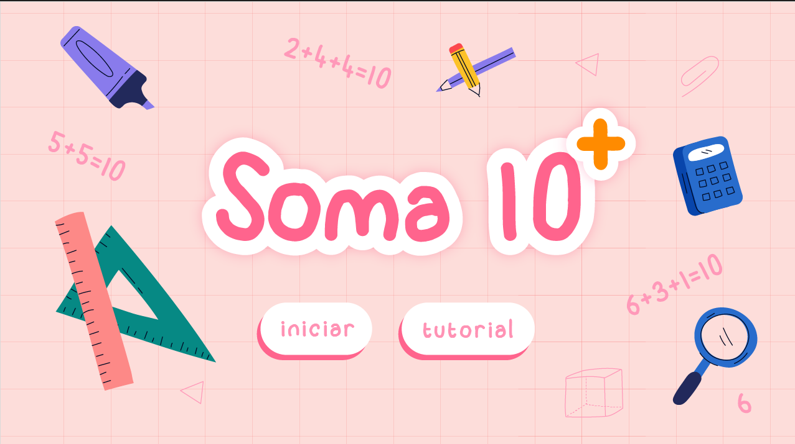
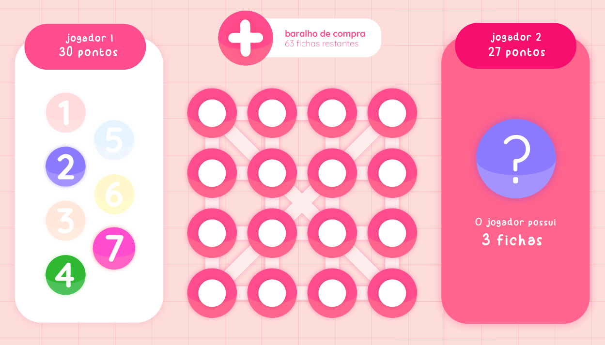
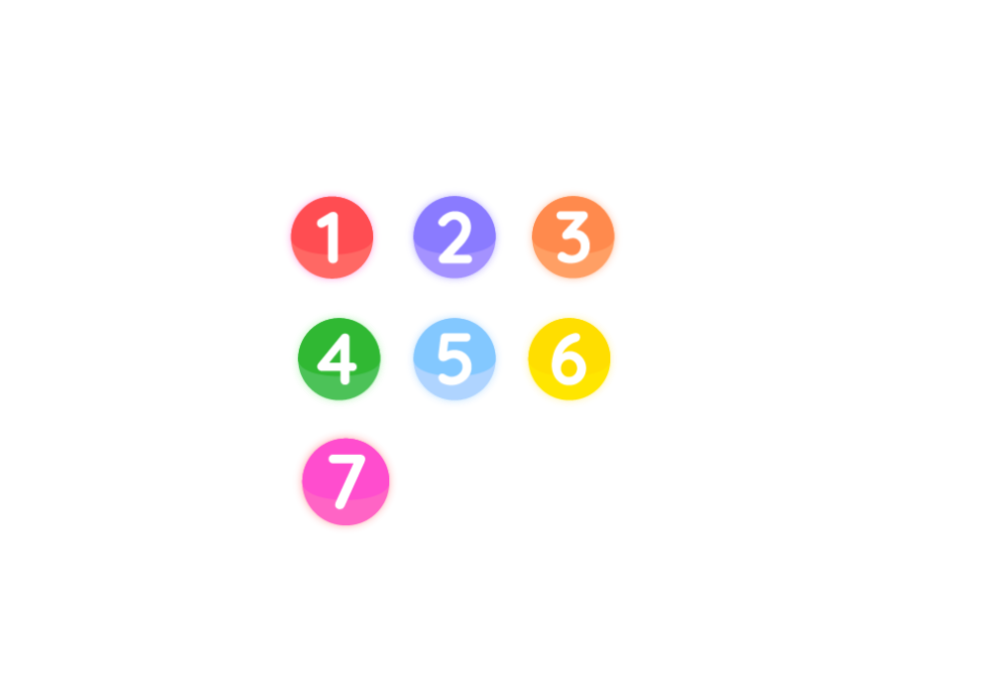

Projeto jogo soma 10
--

Especificação de Requisitos de Software

<!-- comando para iniciar linhas de divisão da tabela-->
 

| Versão   | Autor(es)     | Data    | Ação|
|:-----------:|:----------:|:-----------:|:-----------:|
| 1.0   |Pedro Felipe Menezes   Pedro Henrique Gimenez   Victória Rodrigues Veloso   | conclusão da versão   | Especificaçõ dos requisitos  |

### Conteúdo:

1. Introdução
2. Visão Geral
3. Requisitos da aplicação

Apêndice: regras do jogo soma 10 

 <!-- comando para iniciar nova pagina -->

## 1. Introdução 

### 1.1 Objetivo

Desenvolvimento de um programa distribuído que suporte a disputa de partidas do jogo soma 10, na modalidade usuário contra usuário, on-line.

### 1.2 Definiçõs e abreviaturas

Regras do jogo: ver apêndice.

### 1.3 Referência

Apresentação das regras do jogo (video do canal 
Booktoy Livraria e Editora): https://youtu.be/1ZkDNbzL2qE
## 2. Visão geral

### 2.1 Arquitetura do software

O software desenvolvido conta com a arquitetura cliente-servidor distribuído.

### 2.2 Premissas de desenvolvimento

- O programa deve ser implementado em python;
- O programa deve utilizar a plataforma DOG como suporte de execução distribuída;
- O projeto deve ser produzido utilizando o Visual Paradigm;
- O projeto deve ser produzido utilizando a linguagem UML, segunda versão.

## 3. Requisitos de Software

### 3.1 Requisitos funcionais

**Requisito funcional 1 - iniciar o programa:**  Ao ser executado, o programa deve apresentar na primeira interface (menu inicial) um botão para iniciar a partida .

**Requisito funcional 2 - iniciar partida:** Ao clicar no botão 'iniciar', o programa deve exibir toda a interface da partida.

**Requisito funcional 3 - distribuição de fiehcas iniciais:** O programa deve iniciar a partida distribuindo 3 fichas para cada jogador, retiradas aleatoriamente do baralho.

**Requisito funcional 4 - exibir tutorial do jogo:** OO programa deve contar com um botão para o tutorial do jogo no menu inicial, que ao ser clicado, exibe as regras e instruções em uma nova janela ou seção.

**Requisito funcional 5 - colocar uma ficha no tabuleiro:** O programa deve permitir que o jogador selecione uma ficha da sua mão e a posicione em uma casa vazia no tabuleiro.

**Requisito funcional 6 - verificar somas de 10:** Ao posicionar uma ficha, o programa deve automaticamente verificar se a soma das fichas em uma linha, coluna ou diagonal resulta em 10 e, em caso afirmativo, recolher as fichas dessa linha e somá-las ao total do jogador.

**Requisito funcional 7 - repor fichas da mão:** Após o jogador inserir uma ficha no tabuleiro, o programa deve permitir que o usuário retire uma carta do baralho.

**Requisito funcional 8 - finalizar a partida:** O programa deve finalizar a partida quando o baralho estiver vazio e exibir o vencedor com base no total de pontos acumulados.

**Requisito funcional 9 - exibir o placar:** O programa deve exibir o placar, mostrando a soma total de cada jogador e quem foi o campeão da partida.

### 3.2 Requisitos não funcionais
**Requisito não funcional 1 - tecnologia para interface gráfica:** O framework Tkinter deve ser utilizado para a construção da interface gráfica.

**Requisito não funcional 2 - modelo de interface gráfica:** A interface gráfica deve ser construída com base nas figuras 1 e 2.

    
    
Figura 1. Interface do menu inicial do jogo.  

    
    
Figura 2. Interface da partida.  

## Apêndice: Regras do jogo soma 10

O jogo soma 10 consiste na disputa entre dois participantes em um tabuleiro de 16 casas interligadas entre si. O objetivo do jogo é somar mais pontos que o adversário.

#### Elementos do jogo

Ao total o baralho conta com 66 fichas enumeradas de 1 a 7, sendo: 

- 18 fichas número 1;
- 18 fichas número 2;
- 14 fichas número 3;
- 8 fichas número 4;
- 4 fichas número 5;
- 2 fichas número 6;
- 2 fichas número 7.

    
    
Figura 3. Fichas do jogo soma 10.  

#### Como jogar

1. Cada jogador começa a partida com 3 cartas na mão.
2. Ao colocar uma ficha no tabuleiro, o jogador deve comprar uma nova carta do monte.
3. Se, durante a sua vez, o jogador conseguir somar 10 em uma linha vertical, horizontal ou diagonal, ele recolhe todas as 4 fichas dessa soma.
4. Quando as cartas do baralho se esgotarem, o jogador com a maior soma total vence a partida.
