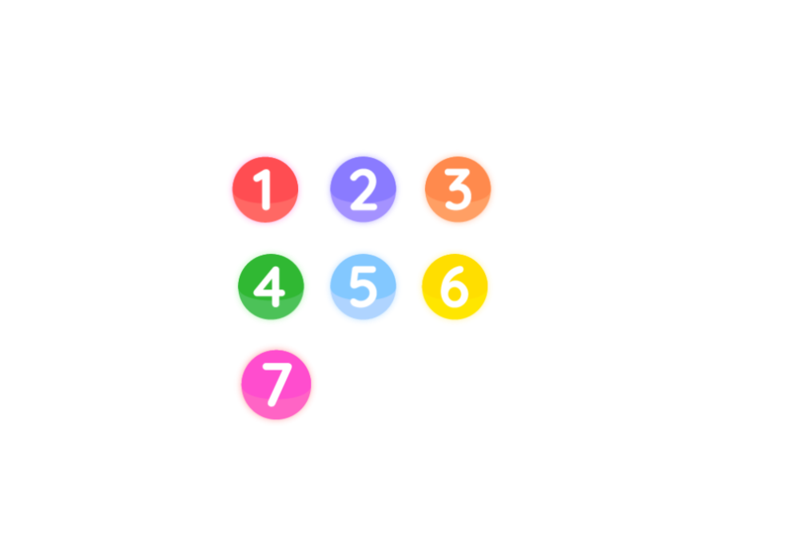

Projeto jogo soma 10
--

Especificação de Requisitos de Software

<!-- comando para iniciar linhas de divisão da tabela-->
 

| Versão   | Autor(es)     | Data    | Ação|
|:-----------:|:----------:|:-----------:|:-----------:|
| 1.0   |Pedro Felipe Menezes   Pedro Henrique Gimenez   Victória Rodrigues Veloso   | conclusão da versão   | Especificaçõ dos requisitos  |

### Conteúdo:

1. Introdução
2. Visão Geral
3. Requisitos de software

Apêndice: regras do jogo soma 10 

 <!-- comando para iniciar nova pagina -->

## 1. Introdução 

### 1.1 Objetivo

Desenvolvimento de um programa distribuído que suporte a disputa de partidas do jogo soma 10, na modalidade usuário contra usuário, on-line.

### 1.2 Definiçõs e abreviaturas

Regras do jogo: ver apêndice.

### 1.3 Referência

## 2. Visão geral

### 2.1 Arquitetura do software

O software desenvolvido conta com a arquitetura cliente-servidor distribuído.

### 2.2 Premissas de desenvolvimento

- O programa deve ser implementado em python;
- O programa deve utilizar a plataforma DOG como suporte de execução distribuída;
- O projeto deve ser produdizo utilizando o Visual Paradigm;
- O projeto deve ser produzido utilizando a linguagem UML, segunda versão.

## 3. Requisitos de Software

### 3.1 Regras de negócio

**Regra de negócio 1 - Recolher fichas no baralho:**

## Apêndice: Regras do jogo soma 10

O jogo soma 10 consiste na disputa entre dois participantes em um tabuleiro de 16 casas interligadas entre si. O objetivo do jogo é somar mais pontos que o adversário.

#### Elementos do jogo

Ao total o baralho conta com 66 fichas enumeradas de 1 a 7, sendo: 

- 18 fichas número 1;
- 18 fichas número 2;
- 14 fichas número 3;
- 8 fichas número 4;
- 4 fichas número 5;
- 2 fichas número 6;
- 2 fichas número 7

    
    
Figura X. Fichas do jogo soma 10.  

#### Como jogar

1. Cada jogador começa a partida com 3 cartas na mão.
2. Ao colocar uma ficha no tabuleiro, o jogador deve comprar uma nova carta do monte.
3. Se, durante a sua vez, o jogador conseguir somar 10 em uma linha vertical, horizontal ou diagonal, ele recolhe todas as 4 fichas dessa soma.
4. Quando as cartas do baralho se esgotarem, o jogador com a maior soma total vence a partida.
